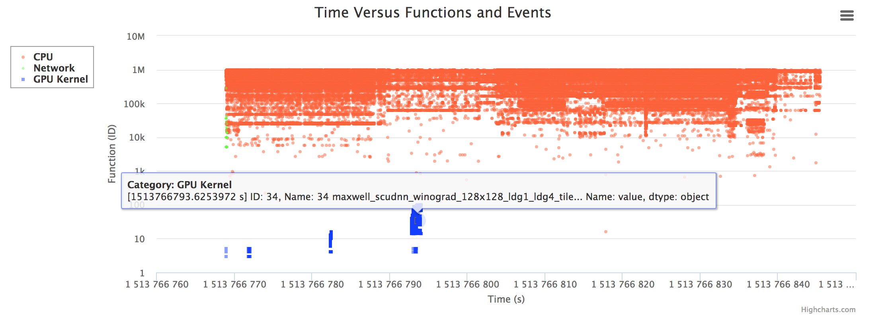
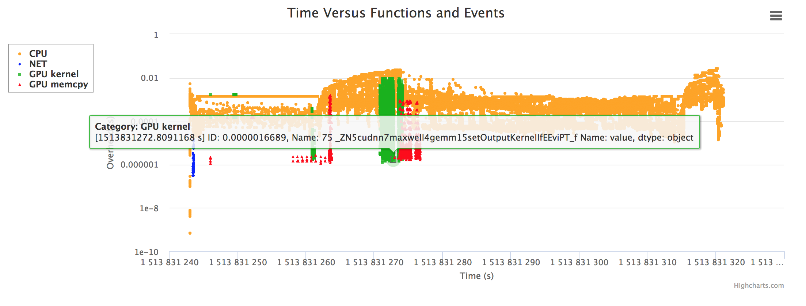

# 1. Introduction
SOFA: Swarm of Functions Analysis  
Authors: All the contributors of SOFA

# 2. Installation 

## 2-1. Prerequisite
`git clone https://github.com/cyliustack/sofa`  
`cd sofa`  
`./tools/prerequisite.sh`   
`./tools/empower-tcpdump.sh $(whoami)`  
`Please re-login to apply changes!`  
Simple Test:  
`tcpdump -w sofa.pcap`  
`tcpdump -r sofa.pcap`  

## 2-2. SOFA Installation 
`./install.sh /your/installation/path/to/sofa`   
`source /path/to/sofa/tools/activate.sh`

# 3. Quick Start 

## 3-1. Hello World 
### Usage1: Basic performance statistics
`sofa stat ping google.com.tw -c 3`  
### Usage2: Performance statistics and visualized analysis
`sofa record ping google.com.tw -c 3`  
`sofa report`  
`open browser with link of http://localhost:8000, http://localhost:8000/cpu-report.html, or http://localhost:8000/gpu-report.html`  
### Usage3: Once finishing preprocessing traces, frequently apply different analyses on traces.
`sofa record your_command [Do it once.]`   
`sofa preprocess [Do it once.]`    
`sofa analyze    [Do it as many times as you would like to.]`

## Interactive and Visualization Result:  
`sofa record ./tools/gpu-train.sh resnet50 64 1`      

`sofa record ./tools/gpu-train.sh resnet50 64 8`      

`sofa record mpirun -f hosts.txt -n 4 ./compute_pi`   

`sofa record ./tools/gpu-train.sh resnet50 32 1 --num_batches=20`      

