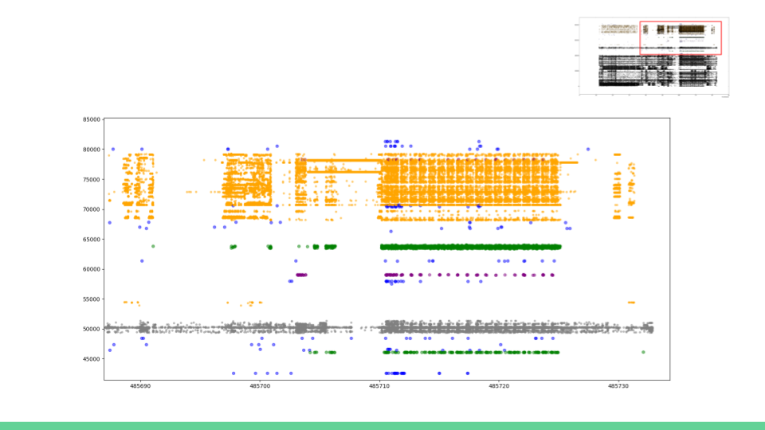

# 1. Introduction
SOFA: Swarm of Functions Analysis  
Authors: All the contributors of SOFA

# 2. Prerequisite

## 2-1. Installation 
### Ubuntu-16.04
`apt-get install boost-dev libpcap-dev libconfig-dev libconfig++-dev linux-tools-common linux-tools-4.8.0-58-generic linux-cloud-tools-4.8.0-58-generic  linux-tools-generic linux-cloud-tools-generic ` 
### Arch Linux
`pacman -S perf`  
`pacman -S boost`  
### Fedora 25
`dnf -y install perf boost-devel libconfig-devel libpcap-devel`
### CentOS 7
`yum -y install centos-release-scl`  
`yum -y install devtoolset-4-gcc*`  
`In Makefile, do that CC := /opt/rh/devtoolset-4/root/bin/gcc`  
`In Makefile, do that CXX := /opt/rh/devtoolset-4/root/bin/g++`  
`yum -y install perf boost-devel libconfig-devel libpcap-devel`  


## 2-2. Perf Configuration
Let ormal users get raw access to kernel tracepoints:  
`sudo sysctl -w kernel.perf_event_paranoid=-1`  
Check the configuration result:  
`cat /proc/sys/kernel/perf_event_paranoid`  

## 2-2. Enable Non-root tcpdump Configuration
`sudo groupadd pcap`   
`sudo usermod -a -G pcap cyliu`   
`sudo chgrp pcap /usr/sbin/tcpdump`  
`sudo chmod 750 /usr/sbin/tcpdump`  
`sudo setcap cap_net_raw,cap_net_admin=eip /usr/sbin/tcpdump`  
Simple Test:  
`tcpdump -w sofa.pcap`  
`tcpdump -r sofa.pcap`  
  

# 3. SOFA Build and Installation 
1. git clone https://github.com/cyliustack/sofa
2. cd sofa 
3. make 
4. sudo make install

# 4. How To Use
## For Case 1
```
cp examples/conf/default-single.cfg  default.cfg
make run
```
## For Case 2
```
cp examples/conf/default-single.cfg default.cfg
sofa --config default.cfg ls -ah  
potato .    
```
## For Case 3
```
cp examples/conf/default-cluster.cfg default.cfg
cp examples/start-all-example.sh .
Modify start-all-example.sh for names of involved nodes
sofa-dist "node0 node1" 10 "sh start-all-processes-on-all-nodes.sh" 
potato .    
```

## Interactive and Visualization Result Provided by Potato:  



