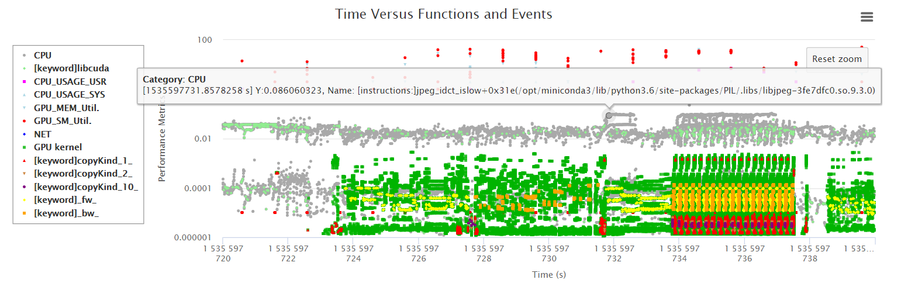
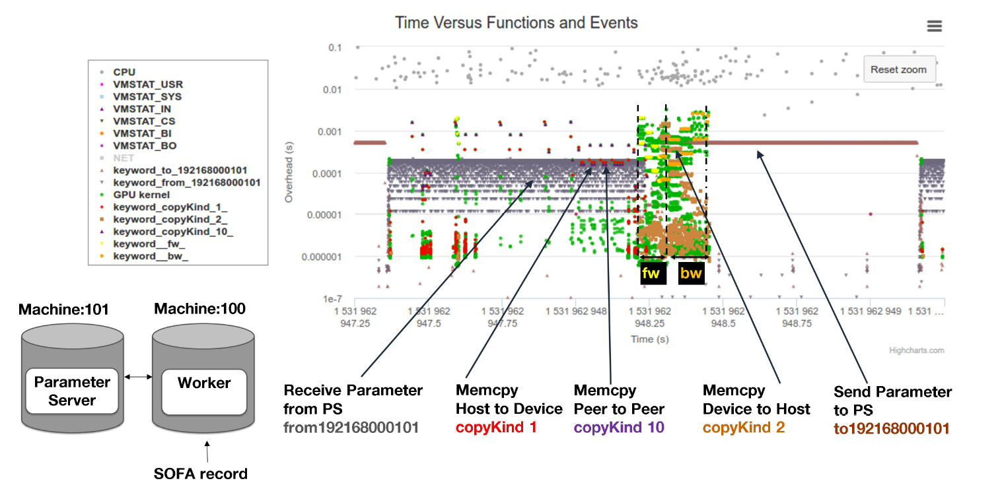
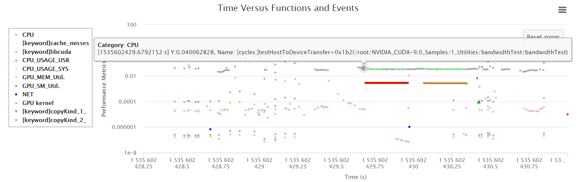
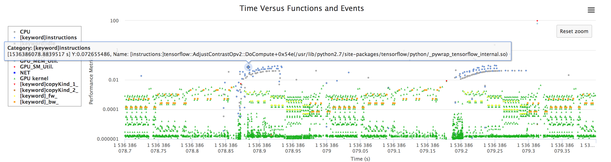

<!--- --->
   
# Introduction
SOFA: SOFA (Swarm-Oriented Function Call Analysis)
Authors: All the contributors of SOFA

# Prerequisite
1. Run `./tools/prepare.sh` to install all the necessary packages and python packages.
2. [OPTIONAL] Run `./tools/empower-tcpdump.sh $(whoami)` to make network related events tracable in SOFA. After running this step, it is required to __re-login__ to __APPLY THE CHANGES__!!!

# Installation
1. Simply run `./install.sh </PATH/TO/INSTALL>` to install SOFA on your system. Note that `sofa` will be appended to the path if the last directory is not sofa.
2. Then, run `source </PATH/TO/INSTALL>/sofa/tools/activate.sh` to activate SOFA running environment. (Need to be executed on each new shell.)
3. [ALTERNATIVE] Add `source </PATH/TO/INSTALL>/sofa/tools/activate.sh` in your `~/.bashrc` to make this environment available on every shell.

# Usages
SOFA supports serveral different usages, like how one can use perf.

## Basic Statistics
1. Profile your program by sampling involved CPUs:   
    `sofa stat "dd if=/dev/zero of=dummy.out bs=100M count=10"`    
2. Profile your program by sampling all CPUs:   
    `sofa stat "dd if=/dev/zero of=dummy.out bs=100M count=10" --profile_all_cpus`   

## Performance Visualizations
1. `sofa record "dd if=/dev/zero of=dummy.out bs=100M count=10"`
2. `sofa report`
3. Open browser with one of the following links for different visualizations
    * [http://localhost:8000](http://localhost:8000)
    * [http://localhost:8000/cpu-report.html](http://localhost:8000/cpu-report.html)
    * [http://localhost:8000/gpu-report.html](http://localhost:8000/gpu-report.html)

# Configurations
SOFA provides options for configurations. Some examples are shown below. Please use `sofa --help` to see more info.  
1. `sofa --cpu_filters="idle:black,tensorflow:orange" record "python tf_cnn_benchmarks.py"`   
2. `sofa --gpu_filters="tensorflow:orange" record "python tf_cnn_benchmarks.py"`   

# Examples of Visualization Results:
`sofa record "python3.6 pytorch_dnn_example.py -a resnet50 /mnt/dataset/imagenet/mini-imagenet/raw-data --epochs=1 --batch-size=64"`   

`sofa record "./scout dt-bench ps:resnet50 --hosts='192.168.0.100,192.168.0.101'"`   

`sofa record "~/cuda_samples/1_Utilities/bandwidthTest/bandwidthTest"`  

`sofa record "./scout t-bench resnet50_real"`   

# Uninstall
Run `bash </PATH/TO/INSTALL>/sofa/tools/uninstall.sh` to safely remove/uninstall files of SOFA.
