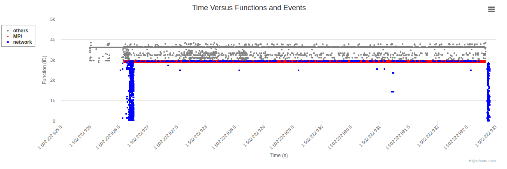
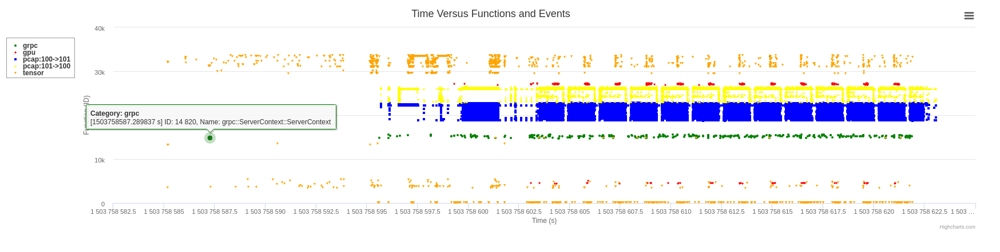

# 1. Introduction
SOFA: Swarm of Functions Analysis  
Authors: All the contributors of SOFA

# 2. Installation 

## 2-1. Prerequisite
`git clone https://github.com/cyliustack/sofa`
`cd sofa` 
`./tools/prerequisite.sh`  
`./tools/empower-tcpdump.sh $(whoami)`  
`Please re-login to apply changes!`
Simple Test:  
`tcpdump -w sofa.pcap`  
`tcpdump -r sofa.pcap`  

## 2-2. SOFA Installation 
`sudo ./sofa-install.sh`

# 3. Quick Start 

## 3-1. Hello World 
`sofa record ping google.com.tw -c 3`  
`sofa stat`  
`sofa report`  

 

## Interactive and Visualization Result Provided by Potato:  

