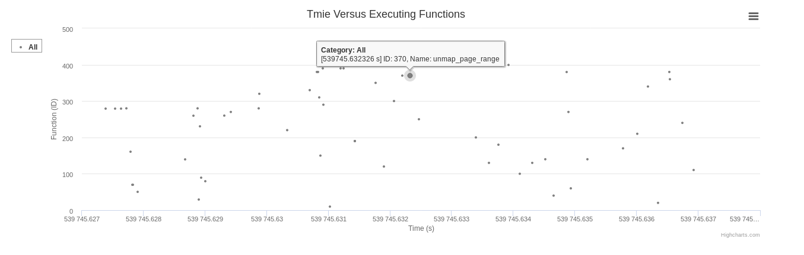

# 1. Introduction
SOFA: Swarm of Functions Analysis  
Authors: All the contributors of SOFA

# 2. Prerequisite

## 2-1. Installation 
### Debian/Ubuntu
`apt-get install perf boost-dev libconfig-dev python-matplotlib` 
### Arch Linux
`pacman -S perf`  
`pacman -S boost`  
`pacman -S python-matplotlib`  
### Fedora 25
`dnf -y install perf boost-devel libconfig-devel python-matplotlib`
### CentOS 7
`yum -y install centos-release-scl`  
`yum -y install devtoolset-4-gcc*`  
`In Makefile, do that CC := /opt/rh/devtoolset-4/root/bin/gcc`  
`In Makefile, do that CXX := /opt/rh/devtoolset-4/root/bin/g++`  
`yum -y install perf boost-devel libconfig-devel python-matplotlib`  


## 2-2. Perf Configuration
`su`  
`echo -1 >  /proc/sys/kernel/perf_event_paranoid`    
With the command above, we get raw access to kernel tracepoints.

# 3. SOFA Build and Installation 
1. git clone https://github.com/cyliustack/sofa
2. cd sofa 
3. make 
4. sudo make install

# 4. How To Use
## For Case 1
```
cp examples/conf/default.cfg .
make run
```
## For Case 2
```
cp examples/conf/default.cfg .
sofa ls -ah  
potato .    
```
## For Case 3
```
cp examples/conf/default.cfg .
cp examples/start-all-example.sh .
Modify start-all-example.sh for names of involved nodes
sofa-dist "node0 node1" 10 "sh start-all-example.sh" 
potato .    
```

## Interactive and Visualization Result Provided by Potato:  




