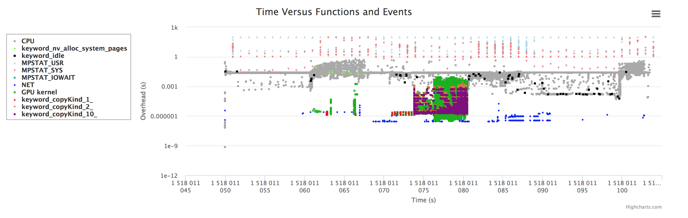
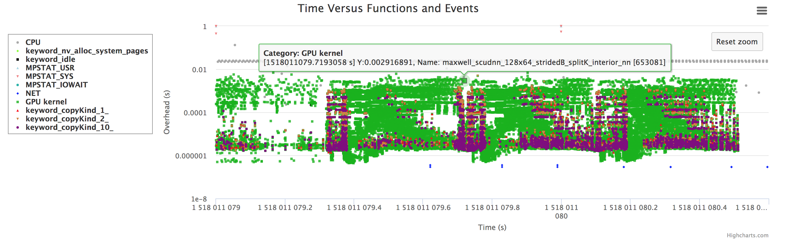
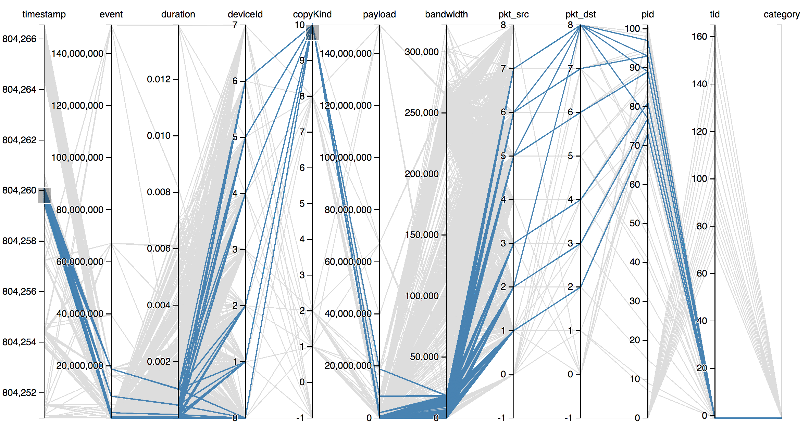

[comment]: # 
# Introduction
SOFA: Swarm of Functions Analysis
Authors: All the contributors of SOFA

# Related Publications
1. Performance Measurement and Analysis Techniques for High-Performance Distributed Deep Learning Systems, Instruments Today - No.216, http://dx.doi.org/10.29662/IT  

# Prerequisite
1. Run `./tools/prerequisite.sh` to install all the necessary packages and python packages.
2. [OPTIONAL] Run `./tools/empower-tcpdump.sh $(whoami)` to make network related events tracable in SOFA. After running this step, it is required to __re-login__ to __APPLY THE CHANGES__!!!

## Verify Permissions
Run the following simple tests to verify the permission settings of executing tcpdump under your permission.
* `tcpdump -w sofa.pcap`
* `tcpdump -r sofa.pcap`

# Installation

1. Simply run `./install.sh </PATH/TO/INSTALL>` to install SOFA on your system. Note that `sofa` will be appended to the path if the last directory is not sofa.
2. Then, run `source </PATH/TO/INSTALL>/sofa/tools/activate.sh` to activate SOFA running environment. (Need to be executed on each new shell.)
3. [ALTERNATIVE] Add `source </PATH/TO/INSTALL>/sofa/tools/activate.sh` in your `~/.bashrc` to make this environment available on every shell.

## Uninstall
Run `bash </PATH/TO/INSTALL>/sofa/tools/uninstall.sh` to safely remove/uninstall files of SOFA.

# Usages
SOFA supports serveral different usages, like how one can use perf.

## Basic Statistics
1. Profile your program by sampling involved CPUs:   
    `sofa stat "wget http://www.bbc.com/news"`    
2. Profile your program by sampling all CPUs:   
    `sofa stat "wget http://www.bbc.com/news" --profile_all_cpus`   

## Performance Visualizations
1. `sofa record "wget http://www.bbc.com/news"`
2. `sofa report`
3. Open browser with one of the following links for different visualizations
    * [http://localhost:8000](http://localhost:8000)
    * [http://localhost:8000/cpu-report.html](http://localhost:8000/cpu-report.html)
    * [http://localhost:8000/gpu-report.html](http://localhost:8000/gpu-report.html)

## Run with different __plugins__
1. Run `sofa record "wget http://www.bbc.com/news"` __only once__ to record the events.
2. Run `sofa preprocess` __only once__ to process the events.
3. Run `sofa analyze` with __A__ plugin.
4. Run `sofa analyze` with __B__ plugin.
5. Run `sofa analyze` with __C__ plugin.

# Configurations

SOFA provides options for configurations. Some examples are shown below. Please use `sofa --help` to see more info.  
1. `sofa --cpu_filters="idle:black,tensorflow:orange" record "python tf_cnn_benchmarks.py"`   
2. `sofa --gpu_filters="tensorflow:orange" --verbose=True record "python tf_cnn_benchmarks.py"`   

# Examples of Visualization Results:
`sofa record "~/cuda_samples/1_Utilities/bandwidthTest/bandwidthTest"`

`sofa record "python tf_cnn_benchmarks.py --num_gpus=8 --batch_size=64 --model=resnet50 --variable_update=parameter_server --num_warmup_batches=1 --num_batches=3"`

`sofa record "python tf_cnn_benchmarks.py --num_gpus=8 --batch_size=64 --model=resnet50 --variable_update=parameter_server --num_warmup_batches=1 --num_batches=3"`

`sofa record "python tf_cnn_benchmarks.py --num_gpus=8 --batch_size=64 --model=alexnet --variable_update=replicated --all_reduce_spec=xring --num_warmup_batches=1 --num_batches=3"`

`sofa record "mpirun -f hosts.txt -n 4 ./compute_pi"`

